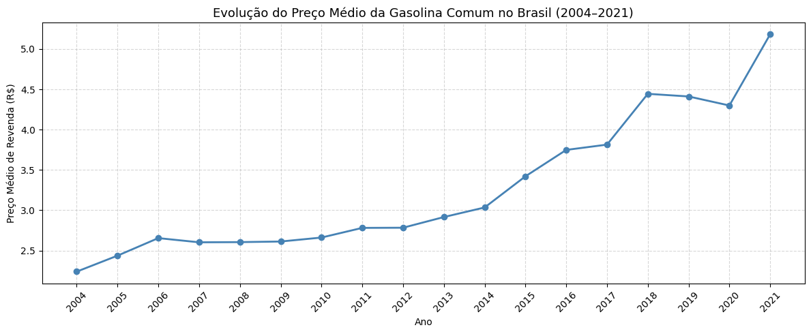
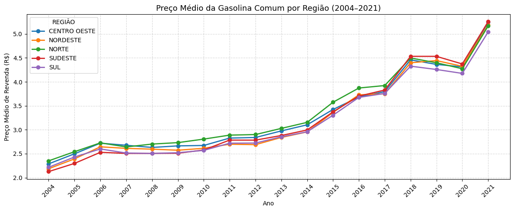
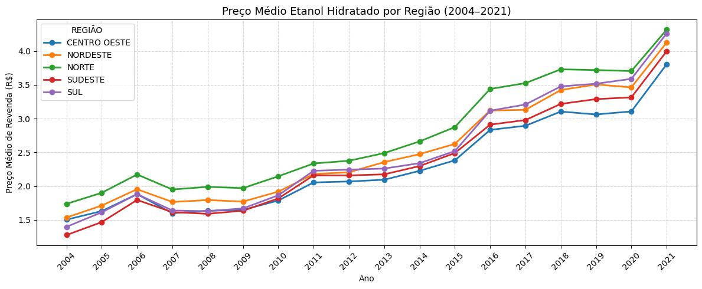
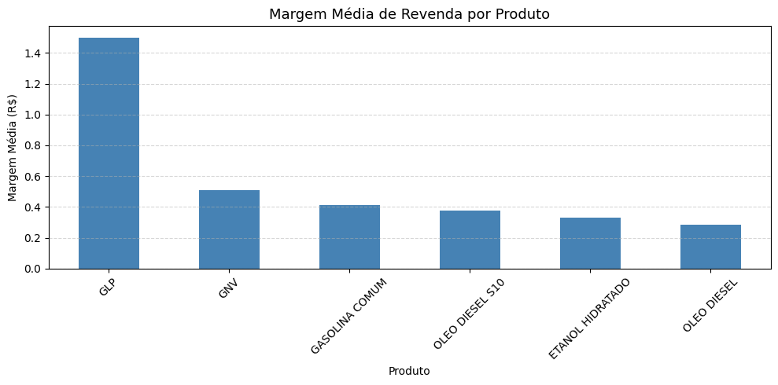
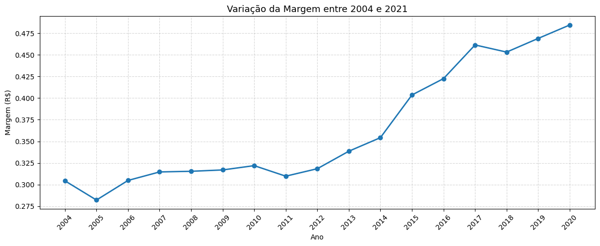
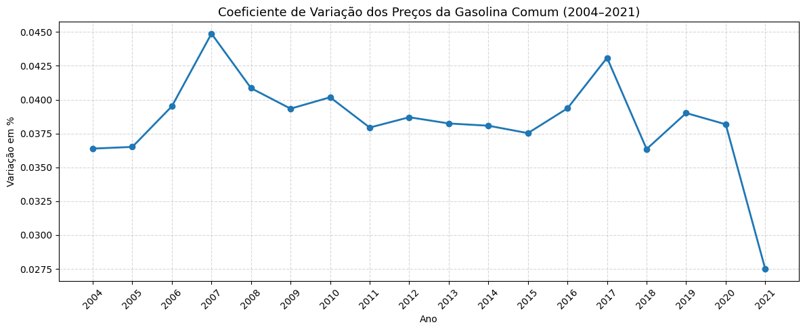
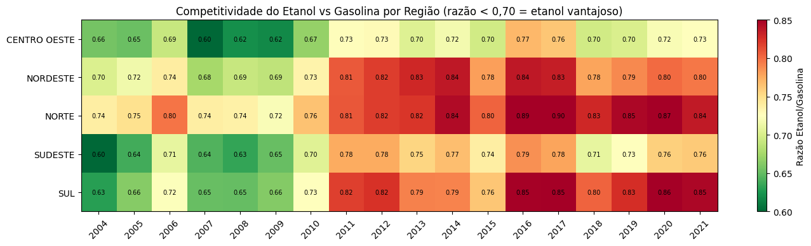

# Combustíveis no Brasil (2004–2021): preço, margem e desigualdade regional

Análise exploratória de 120 mil registros semanais de preços de combustíveis coletados pela ANP em postos de revenda de todo o Brasil. O objetivo é entender como os preços evoluíram ao longo de 17 anos, quais regiões pagam mais caro e quanto os postos lucram por produto.

---

## Fonte dos dados

- **Origem:** Agência Nacional do Petróleo, Gás Natural e Biocombustíveis (ANP)
- **Disponível em:** [Kaggle — Gas Prices in Brazil](https://www.kaggle.com/datasets/matheusfreitag/gas-prices-in-brazil)
- **Período:** maio de 2004 a abril de 2021
- **Escopo:** 27 estados, 5 regiões, 7 produtos analisados
- **Volume:** 120.823 registros, 18 colunas originais

---

## Pergunta analítica central

> Como os preços de combustíveis no Brasil evoluíram entre 2004 e 2021, e quais fatores — políticos, econômicos e logísticos — explicam as diferenças regionais e de margem observadas?

---

## Principais achados

### Achado 1 — Evolução temporal: Gasolina Comum



- Entre 2006 e 2013, os preços permaneceram estagnados em torno de **R$ 2,60**, reflexo da política de subsídio e controle artificial praticada pelo governo sobre os preços da Petrobras.
- A partir de 2016, com a adoção da **PPI (Paridade de Preço Internacional)**, os preços passaram a seguir as cotações do mercado global, provocando alta de aproximadamente **46% entre 2014 e 2018**.
- Em 2021, recuperação da demanda pós-pandemia combinada com desvalorização cambial empurrou o preço ao maior patamar da série: **~R$ 5,20/litro**.

---

### Achado 2 — Desigualdade regional: Gasolina Comum



- A **região Norte** pagou consistentemente os maiores preços do país ao longo de toda a série, reflexo do custo logístico elevado de distribuição em uma região com infraestrutura modal limitada.
- O **Sudeste** assumiu o topo em 2018, impulsionado pelo choque de abastecimento da greve dos caminhoneiros e pela posterior política de reajustes frequentes atrelados ao dólar.
- O **Nordeste** apresentou os menores preços em boa parte da série, beneficiado por incentivos fiscais regionais e pela proximidade com a produção de etanol.

---

### Achado 3 — Desigualdade regional: Etanol Hidratado



- O padrão regional se repete: **Norte consistentemente mais caro** por todo o período, pelo mesmo problema logístico.
- O **Sudeste**, maior produtor de cana-de-açúcar do país, apresentou os menores preços de etanol até 2011. A partir daí, o **Sul** assumiu o menor preço.
- O etanol apresenta **dispersão regional mais acentuada** do que a gasolina, confirmando que é um produto com precificação mais sensível à distância da produção.

---

### Achado 4 — Margem de revenda por produto



- Entre os combustíveis líquidos, a **Gasolina Comum** apresenta a maior margem média de revenda (~R$ 0,41/litro), enquanto o **Óleo Diesel** tem a menor (~R$ 0,28/litro).
- A diferença entre produtos é pequena — os postos operam com margens relativamente homogêneas entre combustíveis.
- O GLP aparece com margem de R$ 1,50, mas não é comparável por ser comercializado por botijão, não por litro.

---

### Achado 5 — Evolução da margem ao longo do tempo



- A margem permaneceu estável entre **R$ 0,28 e R$ 0,32** até 2013, período de controle artificial de preços pela Petrobras.
- A partir de 2014, com a PPI e o fim do subsídio, a margem acelerou até **~R$ 0,48 em 2020** — crescimento de ~60% em 7 anos.
- A volatilidade de preços favoreceu os revendedores, que ampliaram margens para absorver o risco de variação no preço de compra.

---

### Achado 6 — Dispersão de preços entre postos



- O coeficiente de variação oscilou entre **0,036 e 0,045** ao longo de toda a série, sem tendência clara de alta ou queda — o mercado manteve dispersão relativamente estável entre postos.
- Dois picos em **2007 e 2017** coincidem com momentos de instabilidade, sugerindo que choques externos aumentam temporariamente a heterogeneidade entre postos.
- O dado de 2021 foi excluído da interpretação por cobrir apenas até abril.

---

### Achado 7 — Competitividade do etanol vs gasolina



- O **Centro-Oeste** foi a região consistentemente mais favorável ao etanol, mantendo razão abaixo de 0,70 durante quase toda a década de 2000, beneficiado pela proximidade com a produção sucroalcooleira.
- A partir de **2011**, o etanol perdeu competitividade em todas as regiões simultaneamente — reflexo da seca severa no Centro-Sul que reduziu a oferta de cana, combinada com o congelamento artificial do preço da gasolina.
- O **Norte** foi a única região onde o etanol **nunca** foi competitivo em nenhum ano da série, com razão consistentemente acima de 0,74.

---

## Limitações conhecidas

- A coluna `MARGEM MÉDIA REVENDA` continha **3.431 valores sentinela** (representados como `-99999`), excluídos da análise. Esses registros representam ~2,8% do dataset.
- A **Gasolina Aditivada** não possui nenhum valor válido de margem — todos os 749 registros continham o valor sentinela. O produto foi excluído da análise de margem.
- O ano de **2021 cobre apenas até abril**, o que pode distorcer comparações anuais.
- Os dados de distribuição de 2021 apresentaram muitos valores sentinela, inviabilizando o cálculo de margem para esse ano.

---

## Metodologia

- **Linguagem:** Python 3.12
- **Bibliotecas:** pandas, matplotlib, numpy, kagglehub
- **Tratamento realizado:**
  - Padronização de nomes de produtos (`ÓLEO DIESEL` → `OLEO DIESEL`)
  - Conversão de colunas numéricas lidas como `object` via `pd.to_numeric(errors='coerce')`
  - Filtragem de valores sentinela (`-99999`, `100000+`) nas colunas de margem
  - Criação da coluna `MARGEM_CALCULADA` = `PREÇO MÉDIO REVENDA` − `PREÇO MÉDIO DISTRIBUIÇÃO`
  - Merge entre datasets de gasolina e etanol para cálculo da razão de competitividade

## Como reproduzir

```python
import kagglehub
path = kagglehub.dataset_download("matheusfreitag/gas-prices-in-brazil")

import pandas as pd
df = pd.read_csv(f'{path}/2004-2021.tsv', sep='\t', encoding='utf-8')
```

